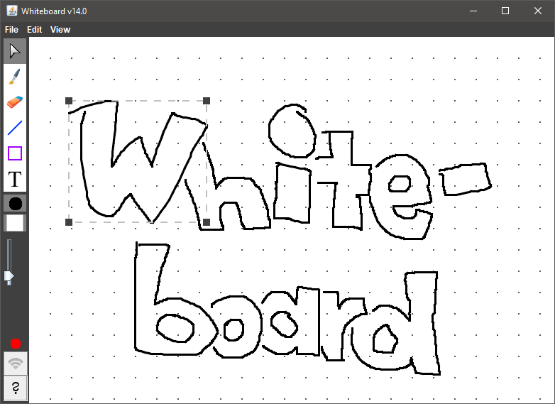

# Whiteboard
2D drawing application based on [Sketch](https://github.com/fwcd/Sketch).

## Running the client
* `./gradlew client:run`

## Running the server
* `./gradlew server:run`

## Running the test client
* `./gradlew testclient:run --console=plain`

## Extending the Protocol
The protocol is defined through [a specification](Protocol.md) and has a default Java implementation. To create additional events and requests, both need to be updated:

* Add the new declaration to [Protocol.md](Protocol.md)
* Navigate to the `shared` module
* For a request:
    * Add the request name to `RequestName`
    * Subclass `Request`
    * Add a new method referencing the subclass to `WhiteboardServer`
* For an event:
    * Add the event name to `EventName`
    * Subclass `Event`
    * Add a new method referencing the subclass to `WhiteboardClient`
* Inside the new subclass:
    * Implement the necessary fields (matching the protocol declaration)
    * Add a protected no-argument-constructor (for Gson)
    * Add a public constructor initializing all fields (including those in superclasses)
    * Add public getters for all added fields
    * Implement toString
* Update `MessageDeserializer`
* Update the `LocalWhiteboardServer`/`LocalWhiteboardClient` implementation
